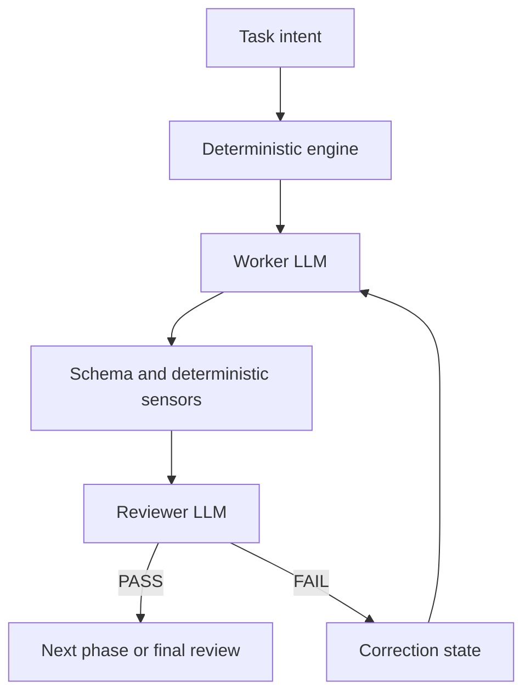

# 결정론적 Flow 실행 아이디어 — GPT-5.6 Sol 리뷰

> 검토자: GPT-5.6 Sol
> 검토일: 2026-08-30
> 검토 기준 커밋: `6e40293`
> 성격: **discovery / architecture review.** 구현 승인이나 확정 설계가 아니며,
> Jira 티켓과 acceptance criteria를 대체하지 않는다.

## 1. 검토 대상 아이디어

현재 `orca-skills`는 다음 두 종류의 흐름을 주로 `SKILL.md` 프롬프트로 정의한다.

- PLAN, DESIGN, IMPLEMENTATION, TEST 같은 각 phase 내부의 작업 및 리뷰 흐름
- phase 사이의 이동, PASS/FAIL 분기, correction loop, iteration 소진 및 종료 흐름

LLM이 이 계약을 읽고 다음 동작을 판단하는 방식에는 두 가지 구조적 비용이 있다.

1. 같은 상태에서도 해석과 행동이 달라질 수 있는 비결정성이 있다.
2. 이미 정해진 제어 규칙을 매번 LLM이 다시 해석하므로 control-flow 자체가 토큰을 소비한다.

제안의 핵심은 다음과 같다.

> 이미 정해진 workflow logic은 코드가 결정론적으로 실행하고, 열린 문제에 대한 작성과
> 판단만 LLM에 남기면 더 예측 가능하고 비용 효율적인 시스템이 되지 않는가?

## 2. 결론

**방향은 타당하며, 장기적으로 채택할 가치가 높다.** 다만 전면적인 prompt-to-code
변환이 아니라 다음 원칙으로 적용해야 한다.

> **Code-defined workflow + Prompt-defined reasoning**

- 코드는 상태, 순서, 불변조건, gate, retry, lifecycle 및 evidence를 소유한다.
- LLM은 요구사항 해석, 산출물 작성, 정성적 검토 및 correction 판단을 담당한다.
- 프롬프트는 제어 프로그램이 아니라 작업과 판단의 계약으로 축소한다.
- Orca는 core logic의 소유자가 아니라 첫 번째 execution adapter가 된다.

이 아이디어의 가장 큰 가치는 토큰 절감보다 **동일한 정책을 반복 가능하게 실행하고,
테스트하고, 중단 후 복구할 수 있게 만드는 것**이다.

## 3. 코드와 LLM의 책임 경계

경계는 “결정 가능한 사실”과 “의미 판단” 사이에 두는 것이 적절하다.

| 결정론적 코드가 소유할 것 | LLM에 남길 것 |
| --- | --- |
| phase graph와 허용 transition | PLAN, DESIGN 및 구현 내용 작성 |
| phase dependency와 실행 순서 | 요구사항의 의미와 우선순위 판단 |
| iteration counter와 최대 반복 횟수 | finding의 타당성과 severity 판단 |
| PASS/FAIL 결과에 따른 분기 | correction 전략과 실제 수정 |
| artifact 위치, 이름 및 schema | 설계가 목적을 충족하는지 검토 |
| 필수 section 및 machine-readable field | 증거보다 넓은 주장인지 판단 |
| test, validator, CI의 실제 상태 수집 | 테스트 결과가 요구사항을 충분히 입증하는지 판단 |
| timeout, retry, cancellation, resume | 모호하거나 충돌하는 요구사항의 해석 |
| role assignment와 freshness 조건 | adversarial review와 새로운 문제 탐색 |
| 로그, digest, provenance 및 terminal state | 사람에게 필요한 설명과 권고 작성 |

코드가 LLM의 판단을 대체해서는 안 된다. 반대로 exact status, counter, dependency,
path existence 같은 사실을 LLM에게 다시 판단시켜서도 안 된다.

## 4. 권장 실행 모델

결정론적 engine이 event loop를 직접 소유해야 한다. 코드가 단지 “다음 phase는
IMPLEMENTATION”이라고 출력하고 Coordinator LLM이 다시 실행한다면 전이 자체는 안정되지만,
LLM turn과 control-token 비용은 계속 남는다.



Engine은 최소 다음을 수행해야 한다.

1. workflow definition과 run state를 읽는다.
2. 현재 state에서 허용된 action만 선택한다.
3. Worker 또는 Reviewer를 실행한다.
4. 결과 artifact와 machine-readable result를 검증한다.
5. deterministic sensor를 실행하고 관측된 사실을 기록한다.
6. PASS이면 다음 phase, FAIL이면 correction state로 전이한다.
7. timeout, retry, iteration exhaustion 및 terminal state를 처리한다.
8. append-only event와 provenance를 남겨 resume와 audit을 가능하게 한다.

## 5. Machine-readable 계약

Markdown report만 읽어 workflow를 제어하면 표현 변화에 따라 parser와 LLM 해석이 흔들린다.
사람이 읽는 report와 engine이 소비하는 result를 분리하는 것이 좋다.

예시:

```json
{
  "schema_version": 1,
  "run_id": "run_...",
  "phase": "IMPLEMENTATION",
  "iteration": 2,
  "role": "phase_reviewer",
  "result": "FAIL",
  "artifact_digest": "sha256:...",
  "findings": [
    {
      "id": "F-001",
      "severity": "MAJOR",
      "blocking": true,
      "responsible_phase": "IMPLEMENTATION"
    }
  ]
}
```

Engine은 vocabulary, schema, digest, source binding과 허용 transition을 검증한다. Finding의
내용과 severity가 타당한지는 Reviewer LLM의 책임으로 남긴다.

## 6. 현재 저장소에서의 출발점

이 제안은 완전히 새로운 engine을 처음부터 만드는 작업으로 볼 필요가 없다.
`scripts/orca_runtime_harness.py`에는 이미 다음과 같은 결정론적 primitive와 real-Orca
scenario가 존재한다.

- Run / Task / Dispatch 생성 및 상태 확인
- Worker와 Reviewer attempt 실행
- reviewer gate result와 review verdict parsing
- lifecycle authority와 terminal close 조건
- phase/iteration timing boundary
- risk 및 quality profile materialization
- final review, correction 및 session reuse scenario

하지만 현재 harness는 주로 contract test와 opt-in runtime scenario를 위한 구조다. 범용적인
사용자 workflow의 production event loop는 여전히 SKILL을 해석하는 LLM이 담당한다.

따라서 권장 방향은 다음 둘을 함께 수행하는 것이다.

1. 기존 harness의 검증된 primitive를 재사용한다.
2. `OrcaRuntimeHarness` 자체를 그대로 core로 승격하지 않고 policy와 Orca I/O를 분리한다.

두 번째 조건이 중요하다. 현재 `OrcaRuntimeHarness`는 생성 시 Orca executable을 resolve하고
직접 Orca CLI를 호출한다. 이를 그대로 production engine으로 만들면 workflow semantics와
Orca execution이 한 클래스에 계속 결합된다.

## 7. 권장 아키텍처

### 7.1 Policy core

Core는 Orca 명령어, terminal handle 또는 특정 agent command를 몰라야 한다.

```text
WorkflowDefinition
WorkflowState
TransitionEngine
GateEvaluator
IterationPolicy
ResultContract
EventRecord
```

Core의 입력은 현재 state와 검증된 event이고, 출력은 허용된 다음 action이다. 같은 입력에는
같은 결과를 내야 하며, transition table 전체를 unit test로 검증할 수 있어야 한다.

### 7.2 Ports

Core와 외부 실행 환경 사이에는 최소 다음 인터페이스가 필요하다.

```text
AgentExecutor
RuntimeStatePort
ArtifactStore
EventSink
DeterministicSensor
HumanApprovalPort
```

### 7.3 Adapters

초기 production adapter는 Orca가 되어야 한다.

```text
OrcaAdapter
  Run / Task / Dispatch
  dependency edges
  terminal lifecycle
  dispatch provenance
  typed wait and status

DirectCommandAdapter
  worker/reviewer subprocess
  local process lifecycle
  reduced provenance guarantee
```

향후 Claude Code, local CLI 또는 다른 harness adapter를 추가할 수 있지만, “호출할 수 있다”와
“동일한 안전 보증을 제공한다”를 구분해야 한다.

## 8. Orca 의존성 변화

Orca 의존성은 하나의 숫자가 아니라 두 축으로 나누어야 한다.

### 8.1 Workflow semantic dependency

현재는 LLM이 Orca-native SKILL의 Run, Task, Dispatch, terminal lifecycle 규칙을 읽고
workflow를 진행한다. 결정론적 core를 도입하면 phase 전이와 gate 의미는 Orca에서
독립된다.

**예상 변화: 높음 → 낮음**

### 8.2 Execution/runtime dependency

Orca adapter를 사용하는 동안 실제 dispatch, terminal lifecycle, dependency provenance와
UI는 계속 Orca에 의존한다.

**예상 변화: 유지되지만 adapter 경계로 집중됨**

| 구조 | Workflow semantic dependency | Runtime dependency | 평가 |
| --- | --- | --- | --- |
| 현재 prompt-driven Skill | 높음 | 높음 | LLM이 정책과 Orca 동작을 함께 해석 |
| Engine이 next action만 계산 | 중간 | 높음 | 결정론은 늘지만 LLM turn이 계속 필요 |
| Deterministic core + Orca adapter | 낮음 | 높음·명시적 | 권장하는 첫 production 목표 |
| Core + 복수 adapter | 낮음 | 선택적 | 장기 목표, 동등 보증 검증 필요 |

따라서 이 방향은 Orca를 즉시 제거하는 변화가 아니다.

> **Orca가 workflow logic의 소유자에서 execution, provenance, UI를 제공하는 adapter로
> 이동하는 변화다.**

LLM이 Orca lifecycle을 매번 이해할 필요는 크게 줄지만, Orca adapter 내부의 의존성은
오히려 더 명시적이고 테스트 가능한 형태로 강화된다.

## 9. Lowest-common-denominator 추상화를 피해야 한다

Harness-neutral core를 만든다는 이유로 Orca가 제공하는 보증을 약화해서는 안 된다.
특히 다음 capability는 단순 subprocess adapter에 자동으로 존재하지 않는다.

- authoritative Run / Task / Dispatch provenance
- dependency edge를 통한 Reviewer ordering
- terminal ownership과 cleanup authority
- typed wait와 settled state 확인
- dispatch-scoped lifecycle receipt

Adapter는 자신이 제공하는 capability를 선언해야 한다.

```json
{
  "dispatch_provenance": true,
  "dependency_edges": true,
  "terminal_ownership": true,
  "typed_wait": true,
  "durable_runtime_state": true
}
```

Workflow가 요구하는 capability를 adapter가 제공하지 못하면 engine은 기능을 조용히
축소하지 말고 fail closed 또는 human escalation 해야 한다. 그래야 Orca 교체 가능성이
안전성 하락을 의미하지 않는다.

## 10. 비용 효율성에 대한 판단

다음 비용은 감소할 가능성이 높다.

- Coordinator가 긴 SKILL의 제어 규칙을 반복해서 읽는 토큰
- 같은 state에서 다음 action을 재판단하는 토큰
- deterministic fact를 LLM이 잘못 해석해 발생하는 불필요한 correction cycle
- 중단 이후 전체 맥락을 다시 구성하는 비용
- 모델 변경에 따라 달라지는 orchestration behavior를 재검증하는 비용

그러나 다음 비용은 계속 필요하다.

- Worker가 task artifact를 생성하는 토큰
- Reviewer가 결과를 정성적으로 검토하는 토큰
- 요구사항, source tree 및 evidence를 읽는 context 비용
- Final Adversarial Review 비용

따라서 “LLM 비용을 제거한다”가 아니라 **LLM을 제어 흐름에서 빼고 고가치 추론에만
사용한다**가 정확한 기대다. 비용 절감은 구현 전에 약속하지 말고 실제 run으로 측정해야 한다.

## 11. 예상 이점

- 동일 state와 event에 대한 동일 transition
- phase skip, 잘못된 retry 및 임의 종료 방지
- transition table과 terminal behavior의 unit testing
- durable state를 이용한 정확한 resume
- model 또는 prompt 변화와 workflow semantics의 분리
- Coordinator control-token 감소
- 실행 이력의 replay와 audit 용이성
- Orca 이외 harness를 비교할 수 있는 명확한 contract

## 12. 위험과 주의점

### 12.1 정책 이중화

같은 규칙이 SKILL 산문과 코드에 각각 존재하면 drift가 발생한다. Machine-readable contract를
source of truth로 정하고, 필요한 설명과 prompt fragment를 생성하거나 validator로 parity를
강제해야 한다.

### 12.2 너무 이른 경직화

아직 discovery 중인 판단을 state machine에 고정하면 workflow 개선 속도가 느려진다. 먼저
안정된 규칙만 코드화하고, adaptive composition 같은 항목은 별도 discovery로 남겨야 한다.

### 12.3 잘못된 결과의 결정론적 확산

결정론은 정확성을 자동으로 보장하지 않는다. 잘못 설계한 transition은 매번 똑같이 잘못
동작한다. 상태 모델, recovery, idempotency와 migration에 대한 adversarial test가 필요하다.

### 12.4 실행 권한 확대

Engine이 agent command를 직접 실행하면 argv, cwd, environment, credential, timeout 및 process
cleanup을 책임져야 한다. Shell string 실행을 피하고 allowlisted structured argv와 명시적인
ownership contract를 사용해야 한다.

### 12.5 관찰성 회귀

Coordinator LLM이 사라져도 사용자에게 현재 phase, 대기 사유, retry 횟수와 필요한 human
action이 보여야 한다. UI가 없는 adapter는 동등한 event/status surface를 제공해야 한다.

## 13. 단계적 도입안

### Stage 0 — Discovery와 baseline 측정

- 현재 run의 control-token, phase transition error, retry 및 elapsed time을 측정한다.
- SKILL 규칙을 deterministic fact와 semantic judgement로 분류한다.
- OS-9, OS-11, OS-16, OS-26과 중복되는 범위를 정리한다.

### Stage 1 — Machine-readable workflow contract

- phase graph, transition, gate, iteration 및 terminal vocabulary를 정의한다.
- 기존 SKILL과 runtime harness가 같은 contract를 읽도록 한다.
- contract drift를 validator로 차단한다.

### Stage 2 — Pure transition engine

- Orca import가 없는 state transition core를 구현한다.
- fake adapter로 PLAN → IMPLEMENTATION 및 FAIL → correction → PASS 흐름을 검증한다.
- 동일 event replay가 동일 state를 만드는지 확인한다.

### Stage 3 — Orca production adapter

- 기존 `OrcaRuntimeHarness` primitive를 분리·재사용한다.
- engine이 실제 event loop와 Orca dispatch를 소유하게 한다.
- 현재 lifecycle, Risk, Quality, Agent Profile 및 Final Review 보증을 보존한다.

### Stage 4 — Secondary adapter PoC

- `claude-glm` / `claude-gemma` 같은 direct command adapter를 제한적으로 검증한다.
- capability 차이를 명시하고 Orca와 동등하지 않은 보증은 지원한다고 주장하지 않는다.
- OS-16 결과와 함께 Orca 선택 의존도를 다시 평가한다.

## 14. 성공 기준

최소 다음 지표를 before / after로 비교해야 한다.

- run당 Coordinator control-token
- 전체 LLM token과 비용
- deterministic fact에 대한 LLM 오판 횟수
- phase transition 및 lifecycle policy violation 횟수
- 동일 입력 반복 실행 시 control-flow 분산
- interrupted run resume 성공률
- 평균 correction iteration과 총 elapsed time
- policy core 내 Orca-specific symbol 참조 수
- adapter별 capability coverage

안전 gate, review depth 또는 evidence 품질을 낮춰 얻은 비용 절감은 성공으로 계산하지 않는다.

## 15. 기존 Roadmap 및 Jira와의 관계

이 아이디어는 다음 항목과 직접 연결된다.

| 항목 | 관계 |
| --- | --- |
| OS-9 | Reviewer Efficiency Phase 2의 token 및 반복 비용 측정 |
| OS-11 | Skill 구조를 policy core, prompt, adapter로 분리하는 기준 |
| OS-13 | 다른 Orca 접근과 execution model 비교 |
| OS-16 | non-Orca adapter와 동등 보증 가능성 검증 |
| OS-26 | deterministic sensors, harness-neutral core, formal state machine 후보 |
| `docs/ROADMAP.md` | policy/execution 분리와 deterministic contract 원칙의 구체화 |

OS-26 전체를 곧바로 구현하는 것으로 해석해서는 안 된다. 먼저 Adopt / Adapt / Reject 분석과
중복 제거를 수행하고, 구현은 좁은 acceptance criteria를 가진 별도 티켓으로 분리하는 것이
적절하다.

## 16. 최종 의견

이 아이디어에 대한 권고는 **ADAPT**다.

- workflow의 이미 정해진 제어 흐름을 코드로 이동한다.
- LLM은 작성, 해석, 리뷰 및 correction 판단에 집중시킨다.
- 기존 deterministic harness의 검증된 부분은 재사용한다.
- harness를 그대로 core로 승격하지 않고 Orca-independent policy core를 먼저 추출한다.
- Orca는 첫 production adapter로 유지해 현재 provenance와 lifecycle 보증을 지킨다.
- 다른 adapter는 capability parity가 증명된 범위에서만 지원한다.
- 비용과 신뢰성 개선은 실제 before / after run으로 입증한다.

목표 상태는 “Orca를 제거한 workflow”가 아니다.

> **Orca에서도 동작하고, Orca의 보증을 명시적으로 활용하지만, workflow semantics 자체는
> Orca와 LLM Coordinator에 종속되지 않는 결정론적 orchestration engine**

이 방향은 `orca-skills`를 프롬프트 모음에서 검증 가능하고 재실행 가능한 workflow system으로
발전시키는 자연스러운 다음 단계다.

## 관련 문서

- [`ROADMAP.md`](ROADMAP.md)
- [`deterministic_flow_idea.review_by_opus.md`](deterministic_flow_idea.review_by_opus.md)
